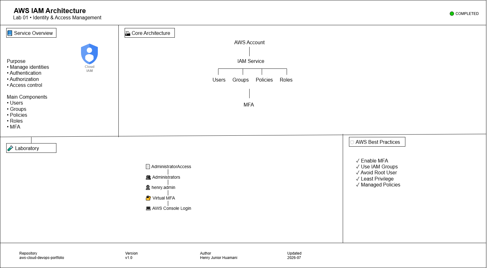
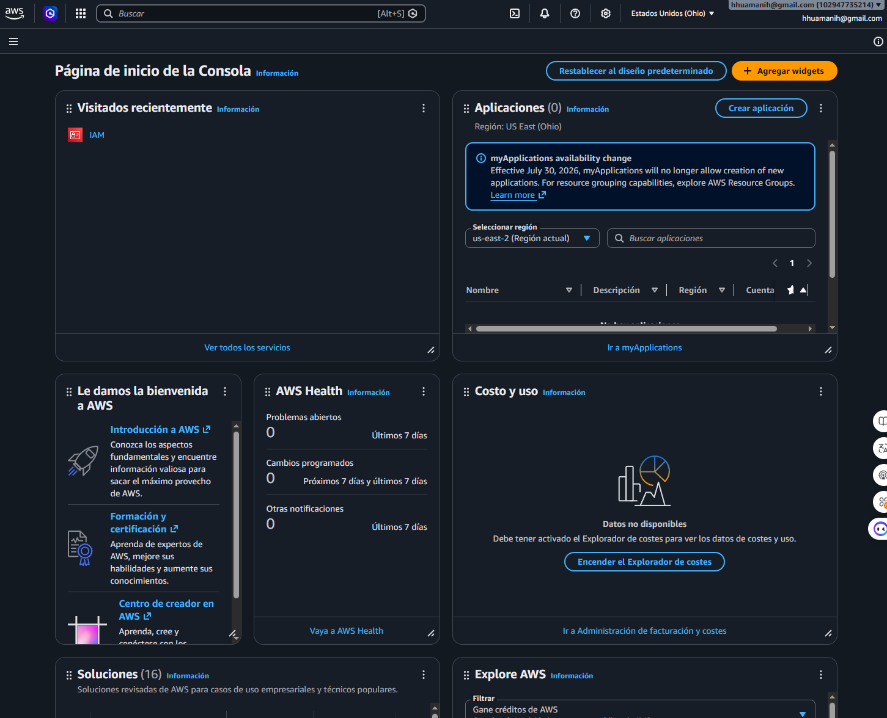
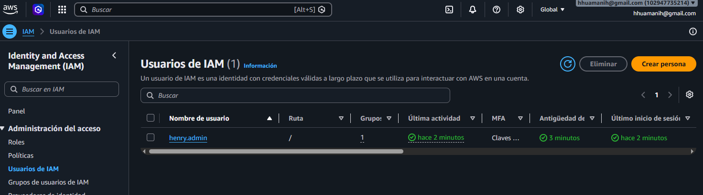
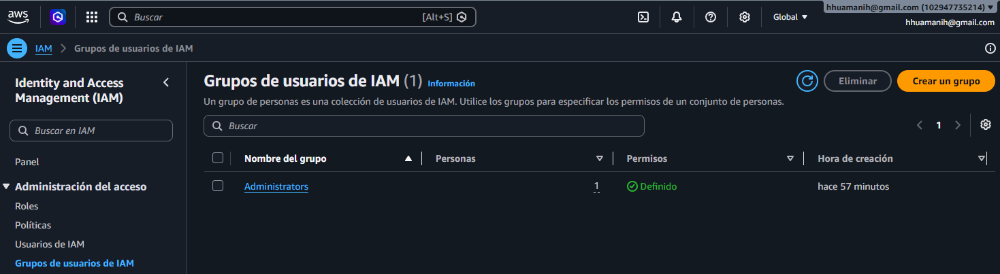
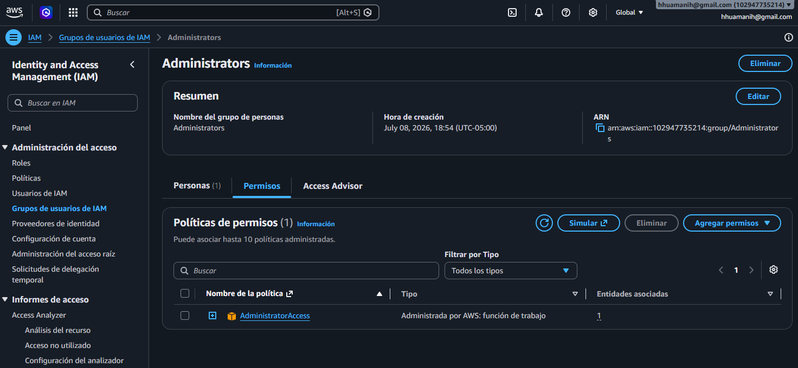
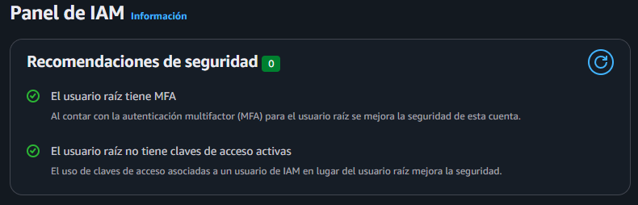
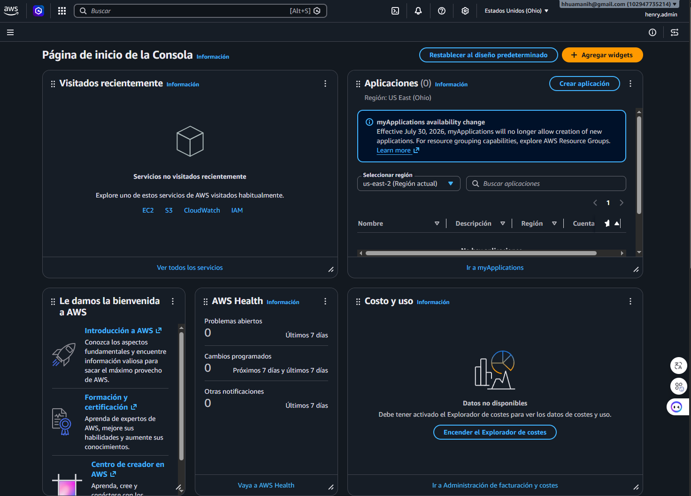

# AWS Identity and Access Management (IAM)


---

# Overview

This laboratory introduces **AWS Identity and Access Management (IAM)**, the AWS service responsible for securely controlling authentication and authorization across AWS resources.

During this lab, a secure administrative environment was created by implementing IAM users, groups, managed policies and Multi-Factor Authentication (MFA), following AWS security best practices.

---

# Objectives

- Understand AWS IAM fundamentals.
- Create IAM users.
- Create IAM groups.
- Attach AWS managed policies.
- Configure Multi-Factor Authentication (MFA).
- Access the AWS Management Console using IAM credentials.

---

# Architecture

The architecture designed for this laboratory is shown below:



## Files

- `architecture/source/iam.drawio`
- `architecture/export/iam.png`
- `architecture/export/iam.svg`

---

# Laboratory Activities

- Create an IAM administrative user.
- Create the **Administrators** group.
- Attach the **AdministratorAccess** managed policy.
- Enable Virtual MFA.
- Validate console access using IAM credentials.

---

# Directory Structure

```text
01-IAM
│
├── architecture
│   ├── source
│   ├── export
│   └── README.md
│
├── evidence
│
├── commands.md
├── study-notes.md
├── interview-questions.md
├── troubleshooting.md
└── README.md
```

---

# Evidence

## AWS IAM Dashboard



---

## IAM User



---

## IAM Group



---

## AdministratorAccess Policy



---

## Virtual MFA



---

## Successful IAM Login



---

# Skills Acquired

- AWS IAM
- Identity Management
- Authentication
- Authorization
- IAM Policies
- IAM Groups
- MFA
- AWS Security Best Practices

---

# AWS Best Practices Applied

- Principle of Least Privilege
- Avoid Root User
- Enable MFA
- Use IAM Groups
- Use Managed Policies

---

# References

- https://docs.aws.amazon.com/IAM/
- https://docs.aws.amazon.com/wellarchitected/

---

# Author

Henry Junior Huamani

AWS Cloud & DevOps Portfolio
