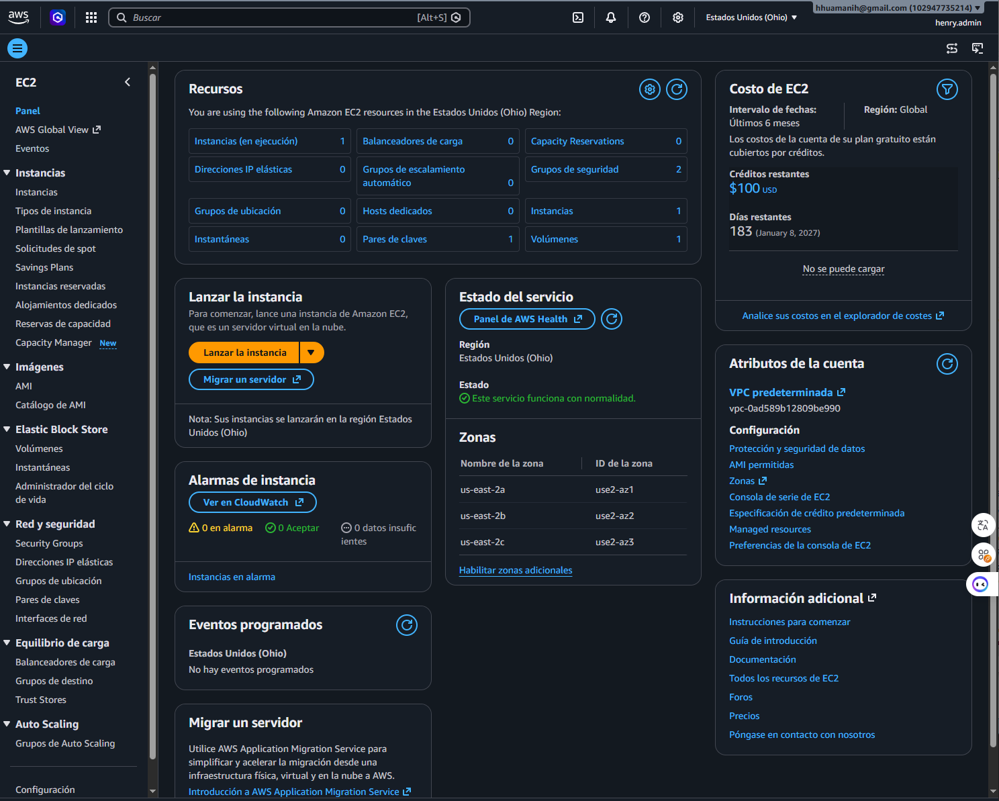
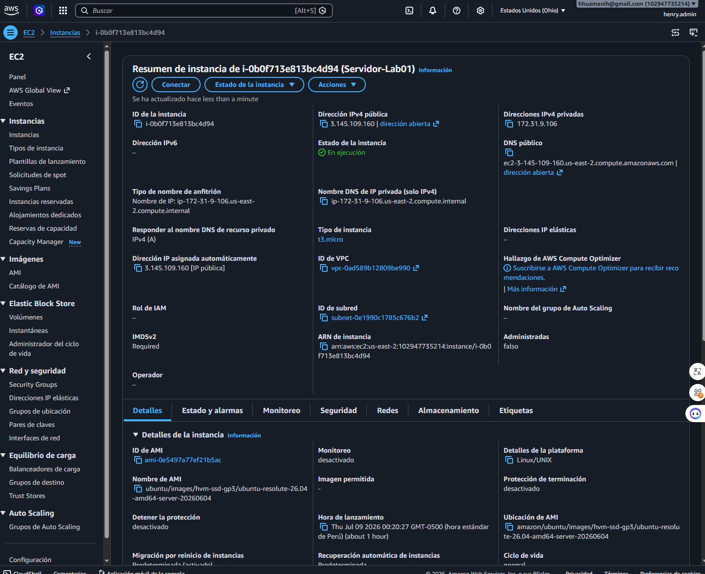
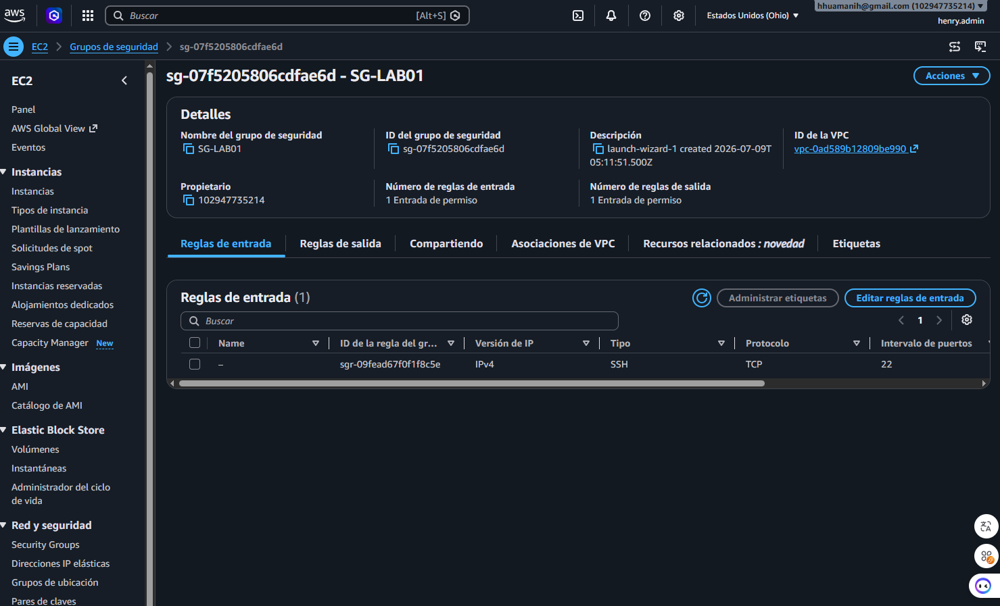
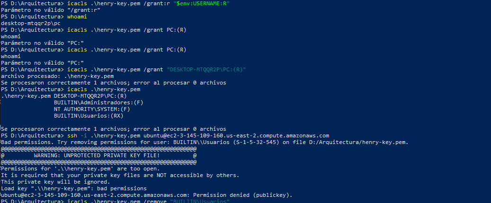
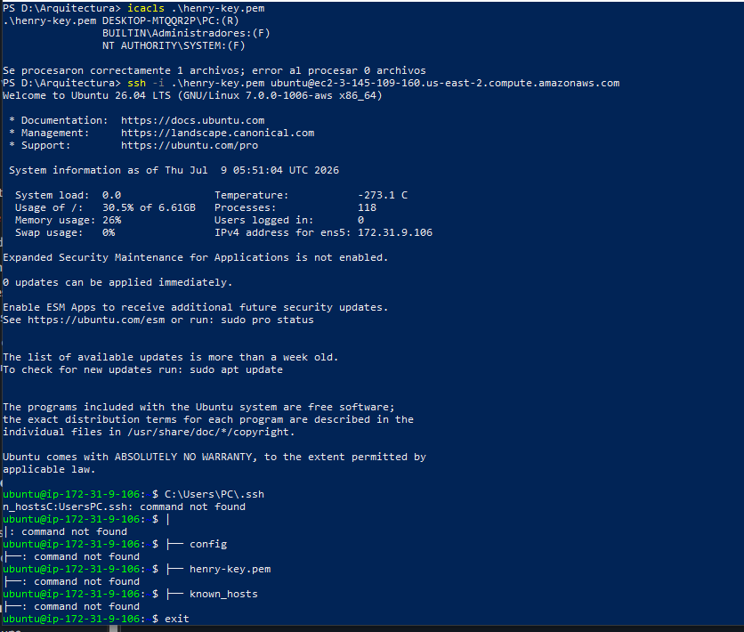

# Amazon Elastic Compute Cloud (EC2)

---

# Overview

Amazon Elastic Compute Cloud (Amazon EC2) is AWS's Infrastructure as a Service (IaaS) offering that provides secure, scalable, and resizable virtual servers in the cloud.

EC2 enables developers, system administrators, and cloud engineers to deploy applications without managing physical hardware while maintaining full control over the operating system, networking, and storage.

---

# Objectives

- Understand Amazon EC2 fundamentals.
- Launch an EC2 instance.
- Connect securely using SSH.
- Configure a Security Group.
- Understand Key Pair authentication.
- Learn the EC2 instance lifecycle.
- Apply AWS security best practices.

---

# What is Amazon EC2?

Amazon EC2 provides virtual machines (instances) running on AWS infrastructure.

Each instance can be customized according to:

- Operating System
- CPU
- Memory
- Storage
- Network Configuration
- Security

Typical use cases include:

- Web Servers
- Application Servers
- Development Environments
- Testing Environments
- Bastion Hosts
- CI/CD Runners

---

# Architecture

The architecture for this laboratory is available in:

## Files

- `architecture/source/ec2.drawio`
- `architecture/export/ec2.png`
- `architecture/export/ec2.svg`

---

# Core Components

| Component | Description |
|----------|-------------|
| EC2 Instance | Virtual server |
| AMI | Operating system image |
| Instance Type | CPU and memory configuration |
| Security Group | Virtual firewall |
| Key Pair | SSH authentication |
| EBS Volume | Persistent storage |
| Public IP | Internet connectivity |

---

# Laboratory Activities

During this laboratory the following tasks were completed:

- Launch an Ubuntu EC2 instance.
- Select the Free Tier eligible instance type.
- Create and download an SSH Key Pair.
- Configure Security Group rules.
- Connect from Windows using SSH.
- Resolve SSH authentication issues.
- Successfully access the Linux terminal.

---

# Instance Details

| Property | Value |
|----------|-------|
| Service | Amazon EC2 |
| Operating System | Ubuntu Server 24.04 LTS |
| Instance Type | t2.micro |
| Storage | 8 GB gp3 |
| Architecture | x86_64 |
| Authentication | SSH Key Pair |
| Region | US East (Ohio) |

---

# Security Configuration

Inbound Rules

| Protocol | Port | Source |
|----------|------|--------|
| SSH | 22 | My IP |

Outbound Rules

| Protocol | Destination |
|----------|-------------|
| All Traffic | 0.0.0.0/0 |

---

# Architecture Decisions

### Operating System

Ubuntu Server 24.04 LTS

Reason

- Long-Term Support (LTS)
- Stable
- Free Tier compatible
- Large community support

---

### Instance Type

t2.micro

Reason

- AWS Free Tier eligible
- Low resource consumption
- Suitable for learning environments

---

### Authentication

SSH Key Pair

Reason

Password authentication is disabled by default for improved security.

---

# Evidence

## EC2 Dashboard

---

## Instance Details

---

## Security Group

---

## SSH Connection Error

---

## Windows Permission Error

---

## Successful SSH Connection

---

# Skills Acquired

- Amazon EC2
- Virtual Machines
- Linux Administration
- SSH Connectivity
- Security Groups
- AWS Networking Basics
- Key Pair Authentication
- Cloud Infrastructure

---

# AWS Best Practices Applied

- Restrict SSH access to My IP.
- Protect private key files.
- Use Security Groups instead of host firewalls when appropriate.
- Avoid using the Root account.
- Stop unused instances to reduce costs.

---

# Cost Optimization

| Resource | Configuration |
|----------|---------------|
| Instance | t2.micro |
| Storage | 8 GB gp3 |
| Pricing Model | AWS Free Tier |

Estimated monthly cost:

**USD 0** (within AWS Free Tier limits)

---

# Lessons Learned

During this laboratory the following concepts were reinforced:

- EC2 instances are virtual machines running on AWS infrastructure.
- Security Groups function as virtual firewalls.
- SSH access requires a valid private key.
- Windows may require permission adjustments for `.pem` files.
- Amazon EC2 provides full operating system control.

---

# References

- https://docs.aws.amazon.com/ec2/
- https://docs.aws.amazon.com/AWSEC2/latest/UserGuide/
- https://aws.amazon.com/ec2/

---

# Author

Henry Junior Huamani

AWS Cloud & DevOps Portfolio
