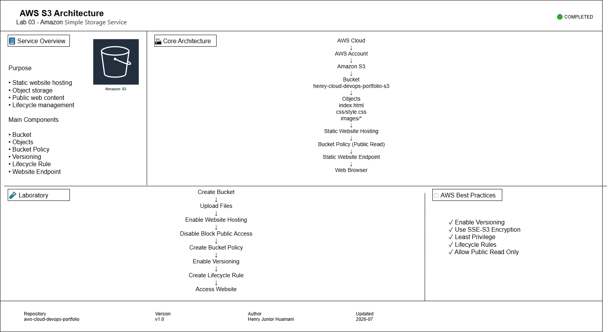

# Lab 03 - Amazon S3 Static Website Hosting

Deploying a static website using **Amazon Simple Storage Service (Amazon S3)** while implementing security best practices, bucket policies, versioning and lifecycle management.

---

## Laboratory Objectives

By completing this laboratory you will learn how to:

- Create a general-purpose Amazon S3 bucket.
- Upload website files to Amazon S3.
- Configure Static Website Hosting.
- Understand the difference between Object URL and Website Endpoint.
- Configure Bucket Policies.
- Manage Block Public Access settings.
- Enable Bucket Versioning.
- Create Lifecycle Rules for storage optimization.
- Publish a static website on Amazon S3.

---

## AWS Services

- Amazon S3
- AWS IAM
- Bucket Policies

---

## Laboratory Architecture

The complete architecture diagram is available below.



Additional files:

- Draw.io Source
- PNG Export
- SVG Export

Available under:

```text
architecture/
```

---

## Laboratory Information

| Item | Value |
|------|-------|
| Laboratory | 03 |
| Service | Amazon S3 |
| Region | US East (Ohio) |
| Bucket Type | General Purpose |
| Encryption | SSE-S3 |
| Versioning | Enabled |
| Lifecycle Rule | Enabled |
| Status | Completed |

---

## Architecture Components

The implemented solution contains the following components:

- AWS Account
- Amazon S3
- General Purpose Bucket
- Static Website Hosting
- Bucket Policy
- Website Endpoint
- Versioning
- Lifecycle Rule
- Web Browser

---

## Implementation Summary

The implementation followed the sequence below:

1. Create an Amazon S3 bucket.
2. Upload website files.
3. Enable Static Website Hosting.
4. Configure public access.
5. Create a Bucket Policy.
6. Publish the website.
7. Enable Bucket Versioning.
8. Configure Lifecycle Rules.

---

## Repository Structure

```text
03-S3
│
├── architecture
│   ├── export
│   ├── source
│   └── README.md
│
├── evidence
│   └── README.md
│
├── commands.md
├── interview-questions.md
├── study-notes.md
├── troubleshooting.md
└── README.md
```

---

## Evidence

Screenshots collected during the laboratory are available under:

```text
evidence/
```

---

## Skills Acquired

During this laboratory the following AWS skills were developed:

- Amazon S3
- Object Storage
- Static Website Hosting
- Bucket Policies
- Block Public Access
- Versioning
- Lifecycle Management
- Storage Classes
- Cost Optimization

---

## Key Concepts

### Bucket

Logical container used to store objects.

### Object

A file stored inside an S3 bucket.

### Static Website Hosting

Feature that allows Amazon S3 to serve HTML, CSS and JavaScript files as a website.

### Bucket Policy

JSON document used to control access permissions to bucket objects.

### Versioning

Preserves multiple versions of an object to prevent accidental overwrites or deletions.

### Lifecycle Rule

Automatically transitions objects between storage classes to optimize costs.

---

## Documentation

Additional documentation is available in:

- commands.md
- study-notes.md
- troubleshooting.md
- interview-questions.md

---

## Laboratory Status

**Completed**